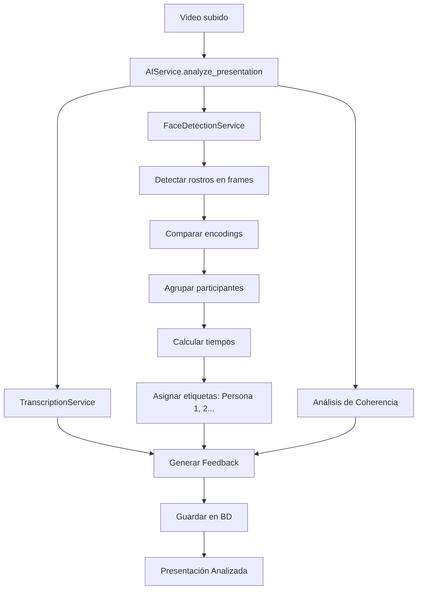

# 🎭 Sistema de Detección y Comparación de Rostros Anónimos

## 📋 Descripción General

Este módulo implementa la **detección y comparación de rostros anónimos** para medir la participación individual en exposiciones grupales, cumpliendo con el objetivo específico del proyecto:

> **"Detectar y comparar rostros en cámara para distinguir participantes, asignando etiquetas genéricas (Persona 1, Persona 2, etc.)"**

## ✨ Características Principales

### 🔍 Detección de Rostros
- ✅ Detecta rostros en cada frame del video
- ✅ Procesa videos completos de manera eficiente (1 frame por segundo por defecto)
- ✅ Utiliza `face_recognition` (basado en dlib) para alta precisión

### 🎯 Comparación y Clustering
- ✅ Compara rostros para identificar participantes únicos
- ✅ Agrupa apariciones del mismo rostro
- ✅ Asigna etiquetas genéricas: **Persona 1**, **Persona 2**, etc.
- ✅ **NO almacena información biométrica ni identifica personas**

### ⏱️ Medición de Participación
- ✅ Calcula tiempo de pantalla de cada participante
- ✅ Determina porcentajes de participación
- ✅ Identifica primera y última aparición de cada persona
- ✅ Cuenta el número de apariciones

### 📊 Score de Equidad
- ✅ Evalúa la distribución del tiempo entre participantes
- ✅ Score de 0-100 (100 = perfectamente equitativo)
- ✅ Penaliza distribuciones muy desiguales

## 🏗️ Arquitectura

```
apps/ai_processor/services/
├── face_detection_service.py  # ⭐ Servicio principal de detección
├── ai_service.py              # Integración con el sistema de IA
└── transcription_service.py   # Transcripción de audio
```

### 📦 Componentes

#### 1. **FaceDetectionService** (`face_detection_service.py`)
Servicio principal que maneja toda la lógica de detección de rostros:

```python
from apps.ai_processor.services.face_detection_service import FaceDetectionService

service = FaceDetectionService(
    tolerance=0.6,      # Sensibilidad de comparación (0.6 = recomendado)
    sample_rate=30      # Procesar 1 frame cada 30 frames (~1 fps)
)

result = service.process_video('/path/to/video.mp4')
```

**Resultado:**
```python
{
    'success': True,
    'participants': [
        {
            'id': 'Persona 1',
            'time_seconds': 120.5,
            'time_formatted': '2 min 0 seg',
            'percentage': 65.2,
            'appearances_count': 360,
            'first_seen': 5.3,
            'last_seen': 175.8
        },
        {
            'id': 'Persona 2',
            'time_seconds': 64.3,
            'time_formatted': '1 min 4 seg',
            'percentage': 34.8,
            'appearances_count': 193,
            'first_seen': 12.1,
            'last_seen': 180.0
        }
    ],
    'score': 84.5,
    'total_participants': 2,
    'video_duration': 185.2,
    'frames_analyzed': 185,
    'faces_detected': 553
}
```

#### 2. **AIService** (`ai_service.py`)
Integra la detección de rostros con el flujo de análisis completo:

```python
from apps.ai_processor.services.ai_service import AIService

ai_service = AIService()
success = ai_service.analyze_presentation(presentation)
```

Ejecuta:
1. ✅ Transcripción de audio (Whisper AI)
2. ✅ **Detección de rostros y participación** ⭐ NUEVO
3. ✅ Análisis de coherencia temática
4. ✅ Generación de feedback automático

## 🔧 Configuración y Parámetros

### Parámetros del FaceDetectionService

| Parámetro | Tipo | Default | Descripción |
|-----------|------|---------|-------------|
| `tolerance` | float | 0.6 | Sensibilidad de comparación de rostros.<br>**Menor** = más estricto (puede crear duplicados)<br>**Mayor** = más permisivo (puede agrupar personas diferentes) |
| `sample_rate` | int | 30 | Procesar 1 frame cada N frames.<br>30 frames ≈ 1 segundo a 30 FPS<br>**Menor** = más preciso pero más lento<br>**Mayor** = más rápido pero menos preciso |

### Recomendaciones de Configuración

```python
# Para videos de alta calidad y rostros claros
service = FaceDetectionService(tolerance=0.5, sample_rate=30)

# Para videos de calidad media o con cambios frecuentes
service = FaceDetectionService(tolerance=0.6, sample_rate=15)

# Para procesamiento rápido (menos preciso)
service = FaceDetectionService(tolerance=0.6, sample_rate=60)
```

## 🧪 Pruebas

### Test Unitario

Ejecuta el script de prueba con un video:

```bash
python test_face_detection.py ruta/al/video.mp4
```

O déjalo buscar automáticamente un video en `uploads/presentations/`:

```bash
python test_face_detection.py
```

**Salida esperada:**
```
==================================================================
🧪 TEST DE DETECCIÓN DE ROSTROS
==================================================================

📹 Archivo de video: uploads/presentations/test.mp4
📊 Tamaño: 15.43 MB

🚀 Inicializando servicio de detección de rostros...

⏳ Procesando video... (esto puede tomar varios minutos)
------------------------------------------------------------------
🎥 Iniciando detección de rostros en: uploads/presentations/test.mp4
📊 Video: 5400 frames, 30.00 FPS, 180.00s duración
⏳ Progreso: 55.5% (100 frames procesados)
✅ Detección completada: 553 rostros detectados en 180 frames
🔍 Agrupando 553 detecciones en participantes únicos...
👤 Persona 1 detectada por primera vez en t=5.30s
👤 Persona 2 detectada por primera vez en t=12.10s
✅ Identificados 2 participantes únicos
🎯 Resultado: 2 participantes identificados, Score: 84.50/100
------------------------------------------------------------------

✅ PROCESAMIENTO COMPLETADO

==================================================================
📊 RESULTADOS DEL ANÁLISIS
==================================================================

👥 Total de participantes detectados: 2
🎬 Duración del video: 180.00 segundos
📸 Frames analizados: 180
👤 Rostros detectados (total): 553
⭐ Score de equidad: 84.5/100

==================================================================
👥 DETALLE DE PARTICIPANTES
==================================================================

──────────────────────────────────────────────────────────────────
👤 Persona 1
──────────────────────────────────────────────────────────────────
   ⏱️  Tiempo en pantalla: 2 min 0 seg
   📊 Porcentaje: 65.2%
   🔢 Apariciones: 360
   ▶️  Primera vez: 5.3s
   ⏹️  Última vez: 175.8s

──────────────────────────────────────────────────────────────────
👤 Persona 2
──────────────────────────────────────────────────────────────────
   ⏱️  Tiempo en pantalla: 1 min 4 seg
   📊 Porcentaje: 34.8%
   🔢 Apariciones: 193
   ▶️  Primera vez: 12.1s
   ⏹️  Última vez: 180.0s

==================================================================
📈 ANÁLISIS DE EQUIDAD
==================================================================

📊 Diferencia máxima de participación: 30.4%
⚠️  Participación MODERADAMENTE equilibrada

⭐ Score de equidad de participación: 84.5/100
   👍 Buena distribución del tiempo

==================================================================
✅ TEST COMPLETADO
==================================================================

💡 PRÓXIMOS PASOS:
   1. El sistema está listo para detectar rostros en videos reales
   2. Sube una presentación desde la interfaz web
   3. El sistema analizará automáticamente la participación
```

## 🗄️ Almacenamiento de Datos

Los datos de participación se guardan en el modelo `Presentation`:

```python
# apps/presentaciones/models.py
class Presentation(models.Model):
    # ... campos existentes ...
    
    participation_data = models.JSONField(
        blank=True, 
        null=True, 
        help_text="Datos de participación detectados mediante análisis de rostros"
    )
    
    analyzed_at = models.DateTimeField(
        blank=True, 
        null=True, 
        help_text="Fecha de análisis completo de IA"
    )
```

**Estructura del JSON almacenado:**
```json
{
    "score": 84.5,
    "participants": [
        {
            "id": "Persona 1",
            "percentage": 65.2,
            "time": "2 min 0 seg",
            "time_seconds": 120.5,
            "appearances": 360
        },
        {
            "id": "Persona 2",
            "percentage": 34.8,
            "time": "1 min 4 seg",
            "time_seconds": 64.3,
            "appearances": 193
        }
    ],
    "total_participants": 2,
    "frames_analyzed": 180,
    "faces_detected": 553
}
```

## 🔒 Privacidad y Seguridad

### ✅ Cumplimiento de Privacidad

El sistema está diseñado para **respetar la privacidad de los estudiantes**:

1. **NO almacena información biométrica:**
   - Los encodings faciales se procesan en memoria
   - NO se guardan en la base de datos
   - Se descartan después del análisis

2. **Etiquetas anónimas:**
   - Los participantes se identifican como "Persona 1", "Persona 2", etc.
   - NO se asocian nombres o identificadores personales
   - Las etiquetas son temporales y relativas al video

3. **Solo métricas de participación:**
   - Se almacenan tiempos y porcentajes
   - NO se guardan imágenes de rostros
   - NO se crea una base de datos de rostros

### 🛡️ Implementación Segura

```python
def _cluster_faces(self, face_detections, fps, video_duration):
    """
    NOTA: Los encodings faciales se procesan pero NO se almacenan
    """
    participant_encodings = []  # Solo en memoria
    
    # ... procesamiento ...
    
    # Los encodings NO se incluyen en el resultado
    for p in participants:
        del p['encoding']  # Eliminar antes de retornar
    
    return participants
```

## 📈 Métricas y Análisis

### Score de Equidad

El score se calcula basándose en la desviación estándar de los porcentajes:

```python
def _calculate_participation_score(self, participants):
    """
    Score de equidad:
    - 100 = Perfectamente equitativo
    - 0 = Muy desigual
    """
    percentages = [p['percentage'] for p in participants]
    std_dev = np.std(percentages)
    mean_percentage = np.mean(percentages)
    
    # Normalizar y calcular score
    normalized_std = (std_dev / mean_percentage) * 100
    score = max(0, 100 - normalized_std)
    
    return round(score, 2)
```

### Interpretación del Score

| Score | Interpretación | Descripción |
|-------|----------------|-------------|
| 90-100 | 🏆 Excelente | Participación perfectamente equilibrada |
| 75-89 | 👍 Buena | Distribución aceptable con ligeras diferencias |
| 60-74 | ⚠️ Aceptable | Diferencias notorias pero manejables |
| 0-59 | ❌ Mejorable | Distribución muy desigual |

## 🚀 Flujo de Procesamiento



## 📚 Dependencias

```txt
# Detección de rostros
face-recognition==1.3.0   # API de alto nivel
dlib==19.24.6             # Librería base para detección
opencv-python==4.10.0.84  # Procesamiento de video

# Análisis numérico
numpy==2.3.1
```

## 🐛 Troubleshooting

### Problema: "No se detectaron rostros"

**Causas comunes:**
- Cámara apagada durante grabación
- Personas fuera del encuadre
- Iluminación muy baja
- Video de muy baja calidad

**Soluciones:**
1. Verificar que el video tenga rostros visibles
2. Ajustar parámetro `sample_rate` (menor = más muestras)
3. Mejorar calidad de video/iluminación

### Problema: Mismo participante detectado como múltiples personas

**Causa:** `tolerance` muy bajo (demasiado estricto)

**Solución:**
```python
service = FaceDetectionService(tolerance=0.65)  # Incrementar
```

### Problema: Diferentes participantes agrupados como uno solo

**Causa:** `tolerance` muy alto (demasiado permisivo)

**Solución:**
```python
service = FaceDetectionService(tolerance=0.55)  # Decrementar
```

### Problema: Procesamiento muy lento

**Causa:** `sample_rate` muy bajo (procesa muchos frames)

**Solución:**
```python
service = FaceDetectionService(sample_rate=60)  # Aumentar (menos frames)
```

## 📝 TODO / Mejoras Futuras

- [ ] Detección de video en vivo vs pregrabado
- [ ] Análisis de contacto visual (detección de mirada)
- [ ] Detección de gestos y movimientos
- [ ] Análisis de postura corporal
- [ ] Soporte para múltiples cámaras/ángulos
- [ ] Procesamiento en tiempo real
- [ ] Optimización con GPU (CUDA)
- [ ] Detección de diapositivas/material de apoyo

## 📖 Referencias

- [face_recognition documentation](https://face-recognition.readthedocs.io/)
- [dlib face recognition](http://dlib.net/face_recognition.py.html)
- [OpenCV Video Processing](https://docs.opencv.org/master/dd/d43/tutorial_py_video_display.html)

## ✅ Estado de Implementación

- ✅ **COMPLETADO**: Detección y comparación de rostros anónimos
- ✅ **COMPLETADO**: Asignación de etiquetas genéricas (Persona 1, 2, etc.)
- ✅ **COMPLETADO**: Medición de tiempo de participación individual
- ✅ **COMPLETADO**: Cálculo de porcentajes de participación
- ✅ **COMPLETADO**: Score de equidad de participación
- ✅ **COMPLETADO**: Integración con sistema de análisis de presentaciones
- ✅ **COMPLETADO**: Almacenamiento en base de datos
- ✅ **COMPLETADO**: Generación de feedback detallado

---

**Última actualización:** Octubre 2025  
**Versión:** 1.0.0  
**Estado:** ✅ Producción
